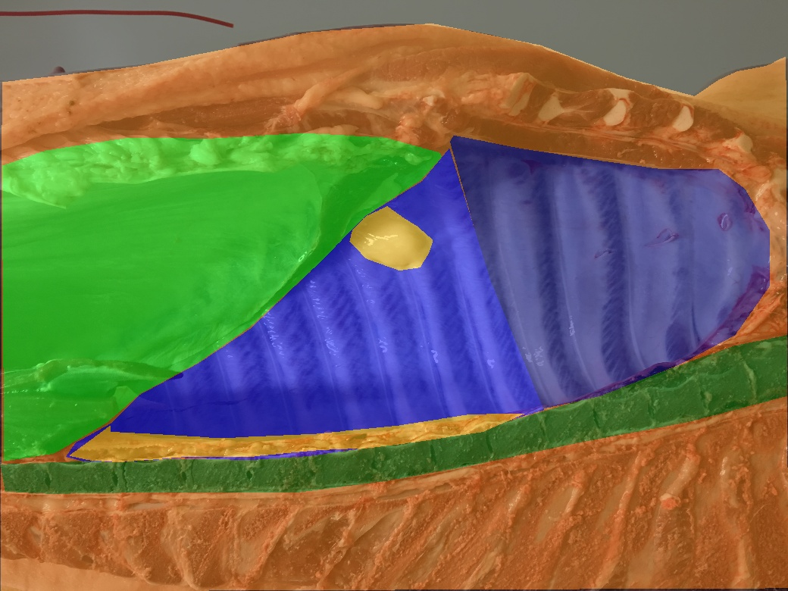
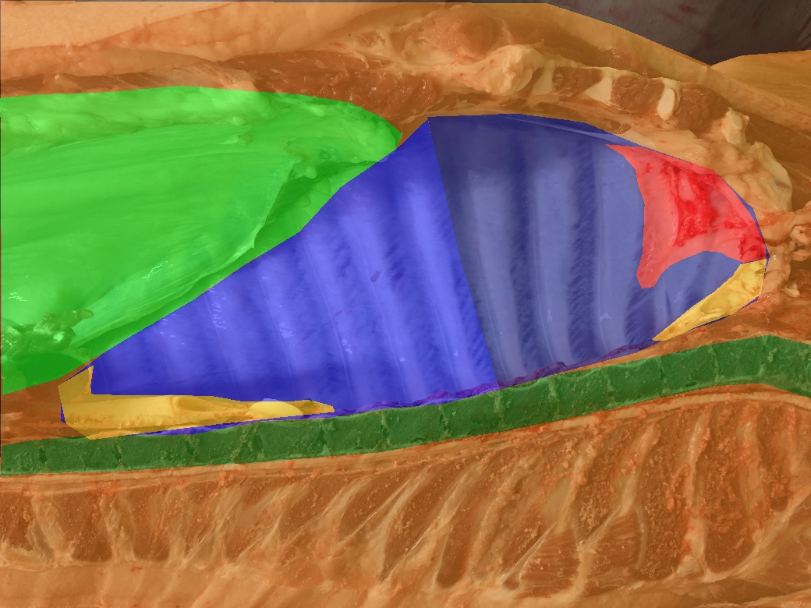
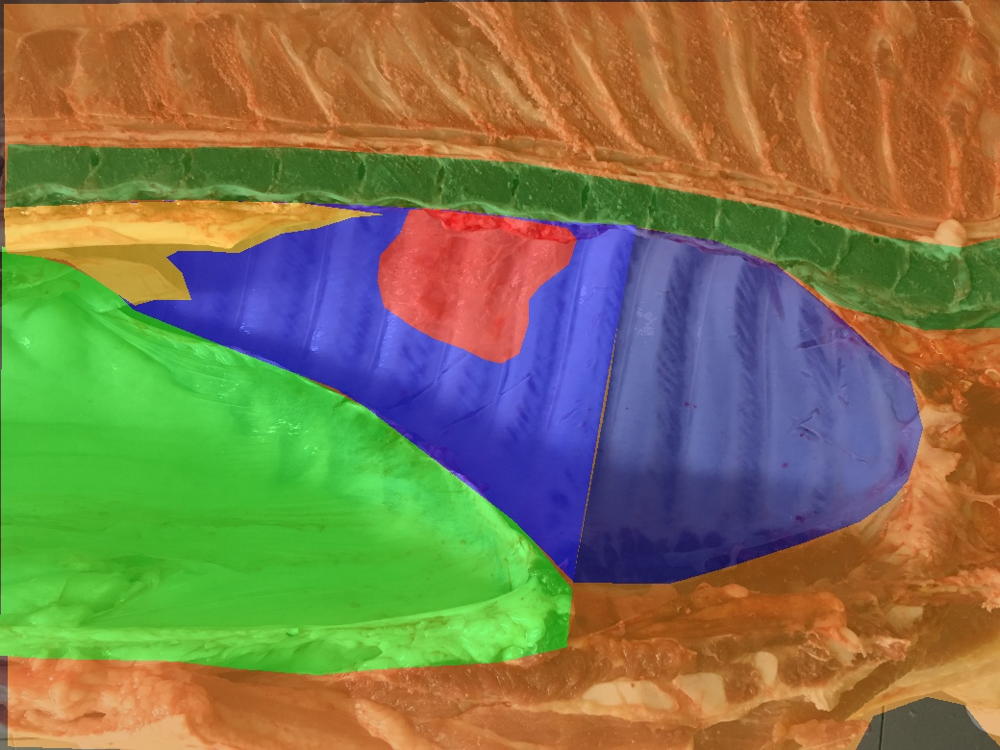
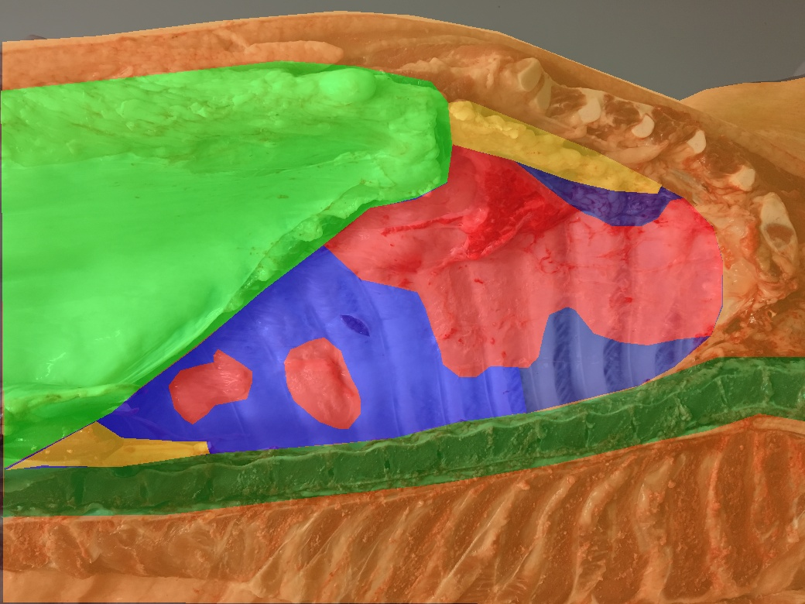

# Segmentation Guided Scoring of Pathological Lesions in Swines Through Convolutional Neural Networks (ID: 34)

## Code
Our UNet-based model can be found in ```code/model.py```. 

Our rule-based classifier is available as a single function in ```code/get_lesion_score_from_segmentation.py```

## Dataset
### Annotation Process
The experts followed a layer-wise annotation strategy. Thus, each anatomical structure is fully annotated even when covered by others:
<th>
  <p align="center">
    
    <br>Layers of the annotation process.


### Pleural Lesion Scoring Test Set
Test set with 200 examples (50 for each class) is available with no restrictions [HERE](https://drive.google.com/open?id=1TvIU5NpMrJdyDrmNJtXF9i6uCS6f7MZ2)

Each example comprises:
- An RGB image (.jpg) with resolution ```1040x780``` pixels;
- A stacked segmentation (.npy) with shape ```1040x780xC```, where C is the number of segmentation classes
  
Associated labels for the pleurisy score task are available in the ```raw_labels.txt``` file.
Examples from the 4 classes are reported:

<table style="width:100%">
    <tr>
        <th>
            <p align="center">
            
            <br>Class i example (Healthy).
            </p>
        </th>
        <th>
            <p align="center">
            
            <br>Class ii example (Lesion on Chest Wall 1).
            </p>
        </th>
     </tr>
 </table>

<table style="width:100%">
    <tr>
        <th>
            <p align="center">
            
            <br>Class iii example (Lesion on Chest Wall 2).
            </p>
        </th>
        <th>
            <p align="center">
            
            <br>Class iv example (Lesion on both Chest Walls).
            </p>
        </th>
     </tr>
 </table>


### Train Set and Pre-Trained Weights
Experts put a lot of their valuable time in the annotation process without direct retribution. As such, we must keep track of the dataset's uses by the community.

##### Research Purposes
Please fill and submit the research purpose statement form. Requests must be submitted by researchers only.

##### Economic Purposes
If you're a private company and you want to get in touch with us, please refers to the article authors' emails. 
